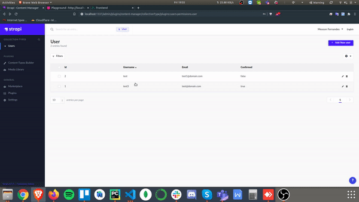

# nuxtjs-strapi-graphql-apollo-ssr

NuxtJS based application using GraphQL and SSR with Strapi based CMS.

## Stack
* Nuxt.js
* Strapi.js
* GraphQL
* SQLite3

## How to start?

1. Start the Strapi server

    `cd backend && yarn develop`

2. Run frontend

    `cd frontend && yarn dev`

Wohoo!!

